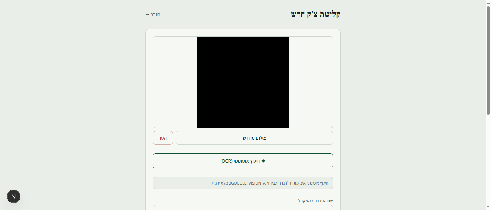

# UI Probe — CheckTrack (new parts) — 2026-06-16

**Scope:** the recently built/changed surfaces — capture screen (form + OCR),
frontal signing, remote signing + one-time tokens, public sign screen, dashboard.
**Method:** live adversarial probe via Playwright MCP against a **safe dev-mode
instance** (in-memory store, auth bypassed, OCR mocked). No real Google data was
touched and no Vision cost was incurred. `.env.local` was backed up and restored
to its production values after the run.
**Build under test:** Next.js 15.5.19, dev server `http://localhost:3000`.

---

## Summary

22 adversarial cases across 5 surfaces. **No Critical / High / Medium findings.**
The security-sensitive paths (one-time signing tokens, XSS, Sheets formula
injection, input validation, double-submit) all held up. Two **Low/cosmetic**
items only.

| Severity | Count |
|---|---|
| Critical | 0 |
| High | 0 |
| Medium | 0 |
| Low | 2 |

---

## What was verified as SAFE (highlights)

- **One-time signing tokens (server-enforced).** A used token is rejected both in
  the UI (`/sign/[token]` → "הצ'ק כבר נחתם") and on a direct API call that bypasses
  the UI (`POST /api/sign/[token]` → **409 "הקישור כבר נוצל"**). Defense in depth.
- **JWT tamper resistance.** A token with an altered signature → "הקישור אינו תקין".
  A garbage token → same clean error, no crash.
- **XSS.** A recipient name of `` is rendered as inert
  text everywhere it appears (dashboard cells, signing-dialog headers) — React
  escaping holds. No script execution, no console error.
- **Google Sheets formula injection.** `lib/google/sheets.ts` writes with
  `valueInputOption: "RAW"` (append + update), so a value like `=HYPERLINK(...)`
  is stored as literal text, never evaluated as a formula.
- **Input validation (capture form).** Empty submit, whitespace-only name
  (trimmed → rejected), negative amount, and zero amount are all rejected with
  clear Hebrew messages. Duplicate check number → "צ'ק ... כבר קיים במערכת".
- **Signature required.** Both signing dialogs reject an empty signer name
  ("יש להזין את שם החותם") and an empty signature pad ("יש לחתום במשטח החתימה").
- **Double-submit.** During signing/sharing the action buttons switch to
  "שומר…/מעבד…/שולח…" and are `disabled`, preventing re-entry.
- **PDF pipeline.** Frontal signing produced a valid PDF (`/api/checks/5000/pdf`
  → 200, `application/pdf`, 92,508 bytes, `%PDF-` header) via Puppeteer.
- **OCR cost-gating.** With no `GOOGLE_VISION_API_KEY`, "חילוץ אוטומטי" degrades
  gracefully: "חילוץ אוטומטי אינו מוגדר … מלא ידנית." — no network call, no cost,
  fields stay editable. 

---

## Findings

### Low-1 — Stale form error persists across actions (cosmetic)
- **Screen/element:** `/capture`, form-level error paragraph.
- **Repro:**
  1. Enter a check number that already exists, click "שמור כלא נמסר" → error
     "צ'ק עם מספר … כבר קיים במערכת" appears.
  2. Without reloading, change the fields and click "החתמה פרונטלית".
  3. The signing dialog opens, but the previous error text is **still shown** at
     the top of the form.
- **Impact:** Minor confusion — the message refers to a state that may no longer
  apply. No functional effect.
- **Suggested fix:** Clear the form-level message when inputs change or when a new
  action (save / sign / share) starts.

### Low-2 — `favicon.ico` 404 on every page (cosmetic)
- **Screen/element:** all routes.
- **Repro:** Load any page → console shows
  `Failed to load resource: 404 (Not Found) @ /favicon.ico`.
- **Impact:** A console error on every page load; no user-visible effect.
- **Suggested fix:** Add an `app/icon.png`/`favicon.ico` (or a `<link rel="icon">`).

---

## Coverage

| Surface | Element / case | Status |
|---|---|---|
| Capture | empty submit | ✅ rejected |
| Capture | whitespace-only name | ✅ rejected (trim) |
| Capture | negative amount | ✅ rejected |
| Capture | zero amount | ✅ rejected |
| Capture | XSS in name | ✅ escaped on render |
| Capture | SQL-ish / special chars in number | ✅ stored as text |
| Capture | duplicate check number | ✅ 409 / clear error |
| Capture | happy-path save | ✅ success |
| Capture | camera/file upload + preview | ✅ works |
| Capture | OCR button (mocked) | ✅ graceful |
| Frontal sign | empty signer name | ✅ rejected |
| Frontal sign | empty signature | ✅ rejected |
| Frontal sign | happy path + PDF | ✅ valid PDF |
| Remote sign | link generation (wa.me/mailto/copy) | ✅ works |
| Public sign | garbage token | ✅ clean error |
| Public sign | tampered JWT signature | ✅ rejected |
| Public sign | valid token render | ✅ spec wording |
| Public sign | empty submit | ✅ rejected |
| Public sign | happy path | ✅ "נקלטה בהצלחה" |
| Public sign | reuse token (UI) | ✅ blocked |
| Public sign | reuse token (direct POST) | ✅ 409 |
| Dashboard | tabs + counts | ✅ correct |
| Dashboard | archive full columns | ✅ correct |
| Dashboard | "שתף שוב" | ✅ regenerates link |
| Dashboard | "החתמה לצד" + auto-refresh + empty state | ✅ works |

**Surfaces:** 5/5 in scope reached. **Forms:** 4/4 (capture, frontal-sign,
remote-sign public, dashboard actions). **No blocking issues.**
